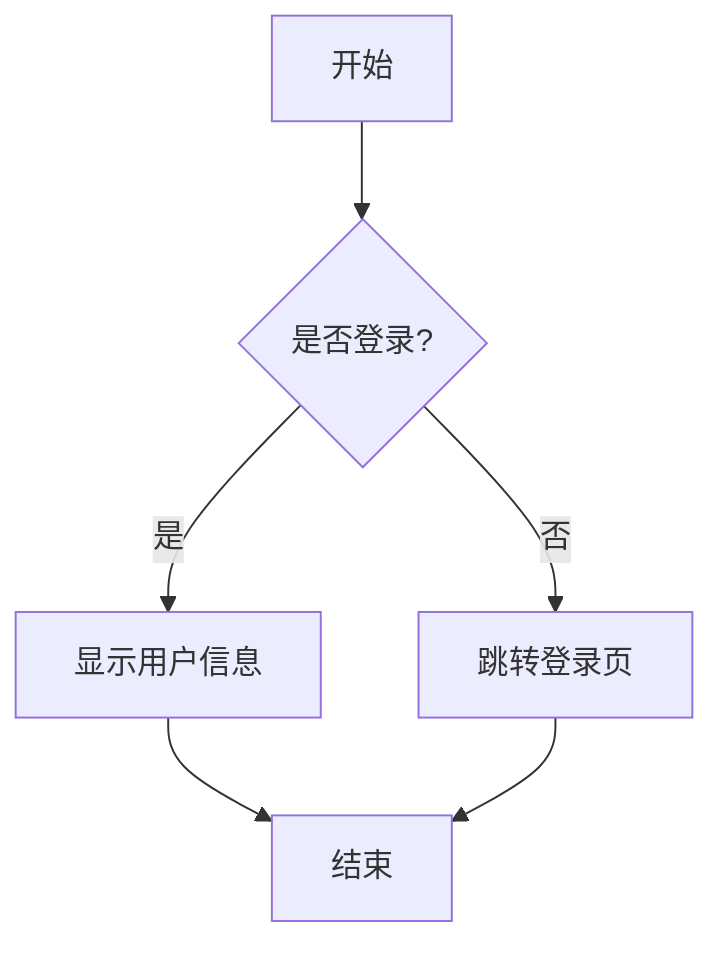
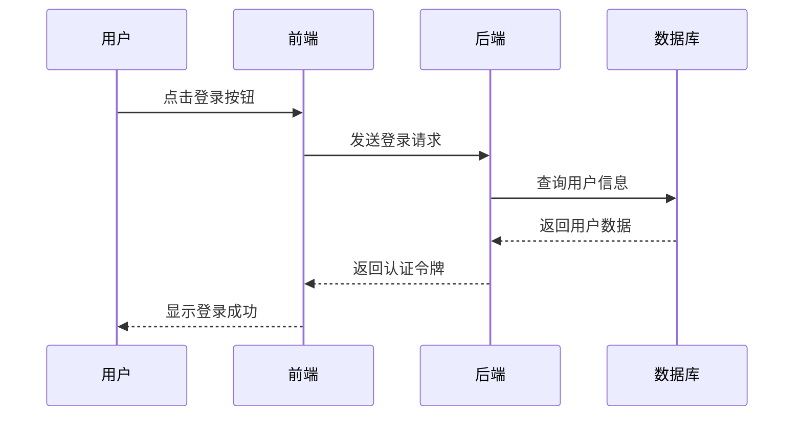
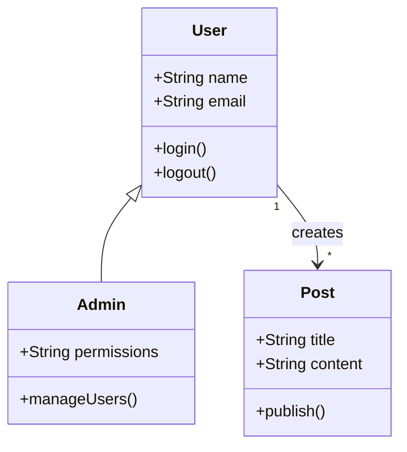
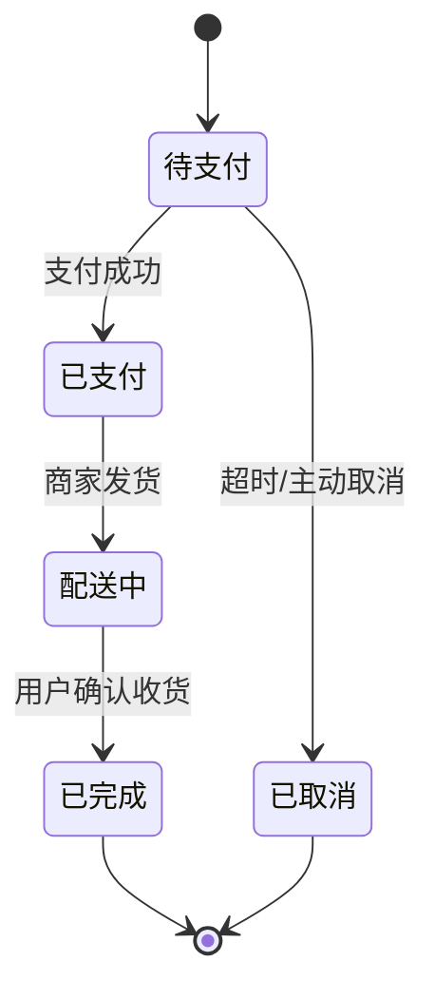
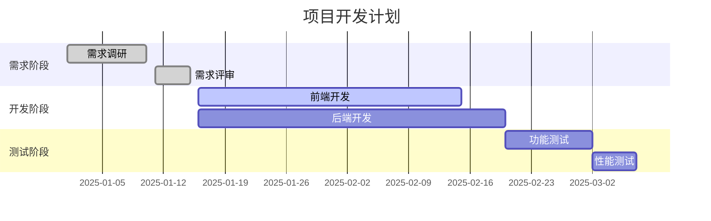
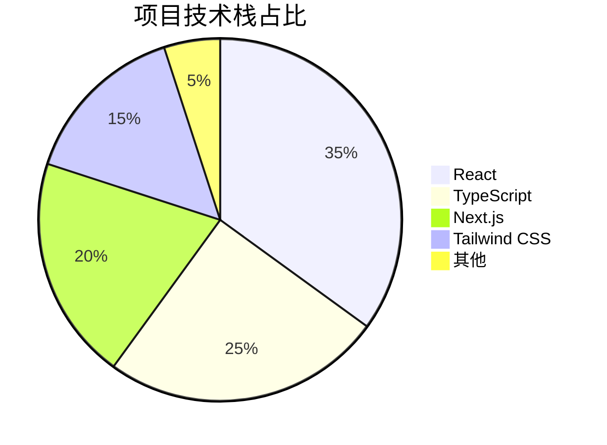
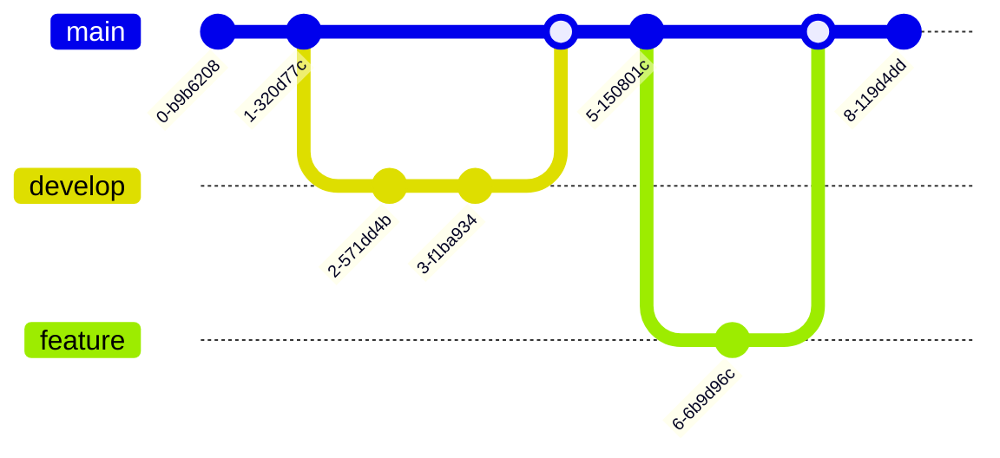
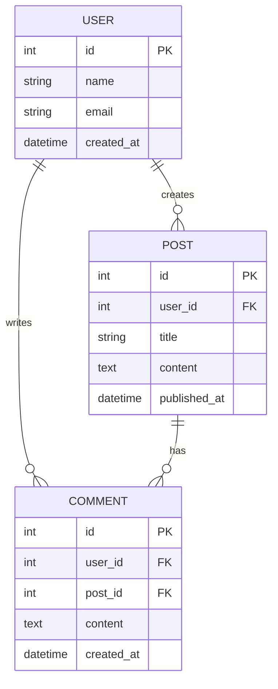

export const metadata = {
  title: 'Mermaid 图表测试',
  date: '2025-11-16',
};

# Mermaid 图表测试页面

这个页面用于测试 Mermaid 图表渲染功能。

## 1. 流程图 (Flowchart)

下面是一个简单的流程图示例:

## 2. 时序图 (Sequence Diagram)

展示前后端交互的时序图:

## 3. 类图 (Class Diagram)

展示面向对象的类关系:

## 4. 状态图 (State Diagram)

展示订单状态的转换:

## 5. 甘特图 (Gantt Chart)

项目计划时间线:

## 6. 饼图 (Pie Chart)

技术栈占比:

## 7. Git 分支图

## 8. ER 图 (Entity Relationship)

数据库表关系:

## 总结

以上展示了 Mermaid 支持的多种图表类型。如果所有图表都能正常渲染,说明 Mermaid 集成成功! 🎉

你可以在 MDX 文件中使用 \`\`\`mermaid 代码块来创建各种图表。

