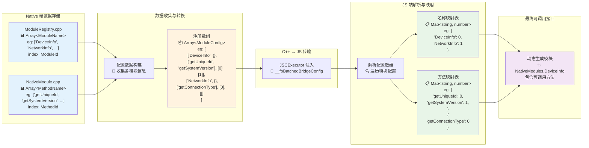

# Native 模块注册数据流图

## 数据转换过程详解



## 数据类型定义

```typescript
// 基础类型
type ModuleId = number;        // 模块在注册数组中的索引
type ModuleName = string;      // 模块名称，如 'DeviceInfo'
type MethodId = number;        // 方法在模块方法数组中的索引
type MethodName = string;      // 方法名称，如 'getDeviceName'
type Constants = any;          // 模块常量
type Methods = Array<MethodName>;           // 方法名称数组
type PromiseMethods = Array<MethodId>;      // 异步方法ID数组
type SyncMethods = Array<MethodId>;         // 同步方法ID数组

// 复合类型
type ModuleConfig = [ModuleName, Constants, Methods, PromiseMethods, SyncMethods];
type ModuleConfigArray = Array<ModuleConfig>;

// JS 端映射类型
type ModuleNameMap = Map<ModuleName, ModuleId>;
type MethodNameMap = Map<MethodName, MethodId>;
```

## 数据转换详细说明

### 1. Native 端数据存储

**ModuleRegistry 数组结构：**

```cpp
// 示例：模块注册表
Array<ModuleName> modules = ["DeviceInfo", "NetworkInfo", "FileManager"];
// 索引映射：DeviceInfo=0, NetworkInfo=1, FileManager=2
```

**NativeModule 方法数组：**

```cpp
// DeviceInfo 模块的方法列表
Array<MethodName> deviceInfoMethods = ["getDeviceName", "getVersion", "getPlatform"];
// 索引映射：getDeviceName=0, getVersion=1, getPlatform=2
```

### 2. 配置数据构建过程

C++ 层遍历所有模块，构建配置数组：

```cpp
ModuleConfigArray config = [
  // [ModuleName, Constants, Methods, PromiseMethods, SyncMethods]
  ["DeviceInfo", {}, ["getDeviceName", "getVersion"], [0, 1], []],
  ["NetworkInfo", {}, ["getConnectionType"], [0], []],
];
```

### 3. JS 端解析与映射建立

**解析配置数组：**

```javascript
// 遍历 __fbBatchedBridgeConfig
config.forEach((moduleConfig, moduleId) => {
  const [moduleName, constants, methods, promiseMethods, syncMethods] = moduleConfig;

  // 建立模块名到ID的映射
  moduleNameMap.set(moduleName, moduleId);

  // 建立方法名到ID的映射
  methods.forEach((methodName, methodId) => {
    methodNameMap.set(`${moduleName}.${methodName}`, methodId);
  });
});
```

**最终映射关系：**

```javascript
// 模块映射
moduleNameMap = {
  "DeviceInfo" => 0,
  "NetworkInfo" => 1
}

// 方法映射
methodNameMap = {
  "DeviceInfo.getDeviceName" => 0,
  "DeviceInfo.getVersion" => 1,
  "NetworkInfo.getConnectionType" => 0
}
```

### 4. 动态模块生成

基于映射关系，JS 端动态创建可调用的模块接口：

```javascript
// 生成 NativeModules.DeviceInfo
NativeModules.DeviceInfo = {
  getDeviceName: () => bridge.callNativeMethod(0, 0), // moduleId=0, methodId=0
  getVersion: () => bridge.callNativeMethod(0, 1),    // moduleId=0, methodId=1
};
```

## 关键转换点总结

1. **索引 → 名称映射**：Native 端的数组索引转换为 JS 端的名称映射
2. **静态 → 动态**：编译时确定的模块结构转换为运行时动态生成的接口
3. **分离 → 统一**：分散在各个模块中的信息统一收集到配置数组中
4. **数组 → 对象**：线性数组结构转换为便于查找的映射对象结构